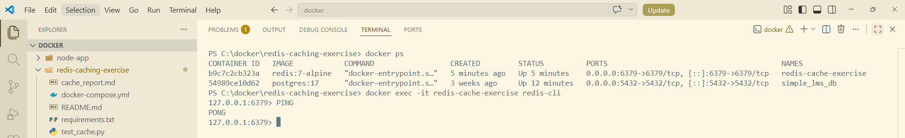
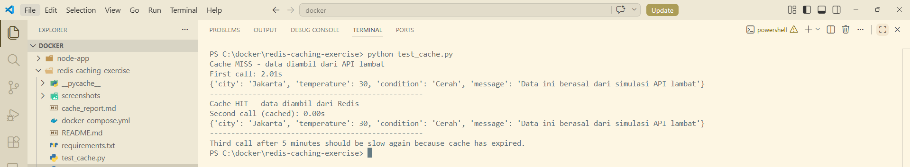

# Redis Caching Exercise Report

## 1. Deskripsi Tugas

Tugas ini bertujuan untuk menerapkan Redis caching pada fungsi `get_weather(city)`. Pada kode awal, setiap pemanggilan fungsi membutuhkan waktu sekitar 2 detik karena terdapat simulasi API lambat menggunakan `time.sleep(2)`.

Dengan Redis caching, hasil pemanggilan pertama akan disimpan ke Redis selama 5 menit atau 300 detik. Jika fungsi dipanggil kembali dengan kota yang sama sebelum cache expired, data akan langsung diambil dari Redis sehingga response time menjadi jauh lebih cepat.

---

## 2. Instalasi dan Menjalankan Redis

Redis dijalankan menggunakan Docker Compose.

File `docker-compose.yml` yang digunakan:

```yaml
services:
  redis:
    image: redis:7-alpine
    container_name: redis-cache-exercise
    ports:
      - "6379:6379"
    volumes:
      - redis_data:/data
    command: ["redis-server", "--appendonly", "yes"]

volumes:
  redis_data:
```

Perintah untuk menjalankan Redis:

```bash
docker compose up -d
```

Perintah untuk masuk ke Redis CLI:

```bash
docker exec -it redis-cache-exercise redis-cli
```

Perintah untuk mengecek Redis berjalan:

```bash
PING
```

Jika Redis berjalan dengan baik, maka hasilnya:

```bash
PONG
```

Screenshot Redis berjalan:



---

## 3. Kode yang Dimodifikasi

File yang dimodifikasi adalah `weather_api.py`.

```python
import json
import time
import redis


CACHE_TTL_SECONDS = 300

redis_client = redis.Redis(
    host="localhost",
    port=6379,
    db=0,
    decode_responses=True
)


def make_cache_key(city):
    return f"weather:{city.strip().lower()}"


def fetch_weather_from_api(city):
    time.sleep(2)

    return {
        "city": city,
        "temperature": 30,
        "condition": "Cerah",
        "message": "Data ini berasal dari simulasi API lambat"
    }


def get_weather(city):
    cache_key = make_cache_key(city)

    cached_weather = redis_client.get(cache_key)

    if cached_weather:
        print("Cache HIT - data diambil dari Redis")
        return json.loads(cached_weather)

    print("Cache MISS - data diambil dari API lambat")

    weather_data = fetch_weather_from_api(city)

    redis_client.set(cache_key, json.dumps(weather_data))
    redis_client.expire(cache_key, CACHE_TTL_SECONDS)

    return weather_data


def clear_weather_cache(city):
    cache_key = make_cache_key(city)
    redis_client.delete(cache_key)
```

---

## 4. Penjelasan Alur Caching

Alur kerja caching pada fungsi `get_weather(city)` adalah sebagai berikut:

1. Sistem membuat cache key berdasarkan nama kota, misalnya `weather:jakarta`.
2. Sistem mengecek apakah data sudah tersedia di Redis menggunakan `GET`.
3. Jika data tersedia, maka data langsung dikembalikan dari Redis.
4. Jika data belum tersedia, sistem menjalankan simulasi API lambat.
5. Data hasil API disimpan ke Redis menggunakan `SET`.
6. Cache diberi masa berlaku 300 detik menggunakan `EXPIRE`.
7. Selama cache belum expired, pemanggilan berikutnya akan jauh lebih cepat.

---

## 5. Redis Commands yang Digunakan

### 5.1 GET

Command `GET` digunakan untuk mengambil data dari Redis berdasarkan key tertentu.

Contoh command Redis:

```bash
GET weather:jakarta
```

Pada program Python, command ini digunakan melalui kode:

```python
cached_weather = redis_client.get(cache_key)
```

---

### 5.2 SET

Command `SET` digunakan untuk menyimpan data ke Redis.

Contoh command Redis:

```bash
SET weather:jakarta '{"city": "Jakarta", "temperature": 30, "condition": "Cerah"}'
```

Pada program Python, command ini digunakan melalui kode:

```python
redis_client.set(cache_key, json.dumps(weather_data))
```

---

### 5.3 EXPIRE

Command `EXPIRE` digunakan untuk memberikan batas waktu penyimpanan cache.

Contoh command Redis:

```bash
EXPIRE weather:jakarta 300
```

Pada program Python, command ini digunakan melalui kode:

```python
redis_client.expire(cache_key, CACHE_TTL_SECONDS)
```

Karena nilai `CACHE_TTL_SECONDS` adalah `300`, maka cache akan expired setelah 300 detik atau 5 menit.

---

### 5.4 TTL

Command `TTL` digunakan untuk melihat sisa waktu cache sebelum expired.

Contoh command Redis:

```bash
TTL weather:jakarta
```

Jika hasilnya berupa angka, berarti cache masih aktif. Angka tersebut menunjukkan sisa waktu cache dalam satuan detik.

---

## 6. Hasil Testing

Testing dilakukan menggunakan file `test_cache.py`.

Perintah yang digunakan:

```bash
python test_cache.py
```

Hasil testing:

```bash
Cache MISS - data diambil dari API lambat
First call: 2.01s
{'city': 'Jakarta', 'temperature': 30, 'condition': 'Cerah', 'message': 'Data ini berasal dari simulasi API lambat'}
--------------------------------------------------
Cache HIT - data diambil dari Redis
Second call (cached): 0.00s
{'city': 'Jakarta', 'temperature': 30, 'condition': 'Cerah', 'message': 'Data ini berasal dari simulasi API lambat'}
--------------------------------------------------
Third call after 5 minutes should be slow again because cache has expired.
```

Screenshot hasil testing:



Berdasarkan hasil testing, pemanggilan pertama membutuhkan waktu sekitar 2 detik karena data belum tersedia di cache. Pemanggilan kedua menjadi sangat cepat karena data sudah tersedia di Redis cache.

---

## 7. Jawaban Pertanyaan

### 7.1 Kenapa response time berbeda?

Response time berbeda karena pada pemanggilan pertama data belum tersedia di Redis cache. Oleh karena itu, sistem harus menjalankan proses pengambilan data dari simulasi API yang lambat menggunakan `time.sleep(2)`. Hal tersebut membuat pemanggilan pertama membutuhkan waktu sekitar 2 detik.

Pada pemanggilan kedua, data sudah tersimpan di Redis. Sistem tidak perlu menjalankan simulasi API lambat lagi, sehingga data langsung diambil dari cache. Karena Redis menyimpan data di memory, proses pengambilan data menjadi sangat cepat dan response time menjadi jauh lebih kecil.

---

### 7.2 Apa keuntungan caching?

Keuntungan caching adalah:

1. Mempercepat response time aplikasi.
2. Mengurangi jumlah request ke API atau database.
3. Mengurangi beban server.
4. Membuat aplikasi lebih efisien.
5. Meningkatkan performa aplikasi, terutama untuk data yang sering diakses.
6. Mengurangi proses berulang untuk data yang hasilnya sama dalam periode tertentu.

---

### 7.3 Kapan sebaiknya tidak menggunakan cache?

Cache sebaiknya tidak digunakan ketika:

1. Data harus selalu real-time.
2. Data sangat sering berubah.
3. Data bersifat sensitif dan tidak aman jika disimpan sementara.
4. Data hanya digunakan sekali dan jarang diakses kembali.
5. Cache dapat menyebabkan pengguna melihat data lama atau tidak akurat.

Contohnya adalah data saldo rekening, status pembayaran, data transaksi penting, atau data stok barang yang berubah sangat cepat dan harus selalu akurat.

---

## 8. Kesimpulan

Implementasi Redis caching pada fungsi `get_weather(city)` berhasil dilakukan. Hasil testing menunjukkan bahwa pemanggilan pertama membutuhkan waktu sekitar 2 detik karena data belum tersedia di cache. Setelah data disimpan ke Redis, pemanggilan kedua menjadi jauh lebih cepat dengan waktu sekitar 0.00 detik.

Dengan demikian, Redis caching dapat meningkatkan performa aplikasi dengan cara menyimpan data sementara dan mengurangi proses pengambilan data berulang.
